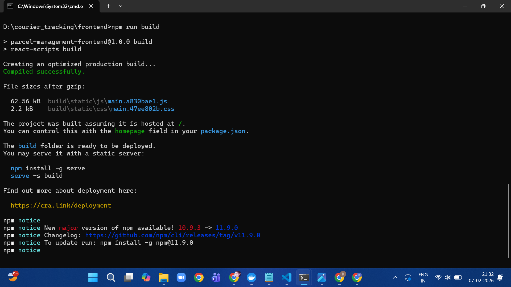
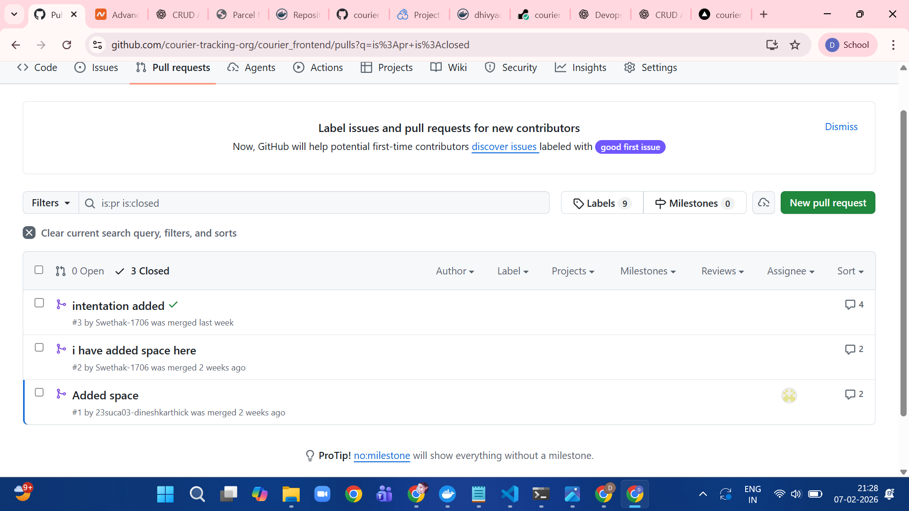
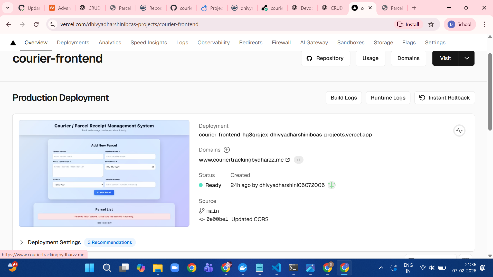

# 📦 Courier Tracking System – Frontend Application

## Overview

A modern, responsive React-based frontend application for managing courier and parcel operations.  
This system provides a clean and intuitive dashboard to create, view, edit, and track courier parcels efficiently.

The Courier Tracking frontend acts as a parcel management interface that communicates with a Spring Boot backend using RESTful APIs.

---

## 📊 Project Presentation

View the comprehensive project presentation to understand the complete architecture, design decisions, and implementation details:

📄 [Courier Tracking Project Presentation](./devimg/courier-tracking-project-presentation.pdf)

This presentation covers:
- Project overview and objectives
- Architecture and design patterns
- Technology stack rationale
- Features and capabilities
- Deployment strategy
- Challenges and solutions

---

## What Does This Frontend Do?

This Courier Tracking frontend is a complete management dashboard that allows users to:

- Add new courier parcels
- View all existing parcels
- Edit parcel details
- Track parcel delivery status (Received, In Transit, Delivered)
- Receive real-time updates through backend API integration
- Access the system on desktop and mobile devices with a responsive UI

---

## Tech Stack

- **Framework:** React 18
- **Build Tool:** Vite
- **HTTP Client:** Axios
- **Language:** JavaScript (ES Modules)
- **Styling:** CSS
- **Deployment:** Vercel

---

## Project Structure


src/
├── components/
│ ├── ParcelForm.js # Form to create new parcels
│ ├── ParcelList.js # Displays list of parcels
│ └── EditParcelModal.js # Modal to edit parcel details
│
├── services/
│ └── parcelService.js # Axios API service for backend communication
│
├── App.js # Main application component
├── index.js # Application entry point
└── App.css # Global styles


---

## Features

- 📦 Parcel creation and listing  
- ✏️ Edit parcel details  
- 🔄 Real-time backend API integration  
- 📱 Responsive user interface  
- ⚡ Fast performance with Vite  

---

## Development – Frontend Setup

### Prerequisites

- Node.js 16+
- npm

### Installation

```bash
git clone https://github.com/courier-tracking-org/courier_frontend.git
cd courier_frontend
npm install

Start Development Server
npm run dev


The application will be available at:

👉 http://localhost:3000

API Integration

The frontend communicates with the backend using Axios through the parcelService.js module.

Backend Dependency

This frontend depends on a Spring Boot backend service that provides REST APIs for managing parcels.

⚠️ Without the backend service running, the UI will load but data operations will not function.

Environment Configuration

The backend API base URL is configured using environment variables.

Example .env file
VITE_API_BASE_URL=https://<backend-url>


This allows smooth switching between local, staging, and production environments.

Build Frontend for Production
npm run build

Preview Production Build
npm run preview

Frontend Build Screenshot



Code Quality – SonarCloud

This project integrates SonarCloud for static code analysis and quality monitoring.

Organization: courier-tracking-org

Project Key: courier-tracking-org

SonarCloud URL: https://sonarcloud.io


Project Pull Request Workflow

For contributing to this project, follow the standard Git workflow:

Create a feature branch from main

Commit changes with clear messages

Push to your branch

Create a Pull Request

Ensure all CI checks pass before merging



🚀 Deployment

This frontend application is deployed on Vercel and is live at:

🌐 https://couriertracking.vercel.app

GitHub repository is connected to Vercel

Each push to the main branch triggers automatic deployment

Vercel's global CDN ensures fast delivery and low latency




Challenges Faced and Solutions Implemented
Challenge 1: Backend API Connectivity

Issue: Reliable frontend–backend communication
Solution: Implemented environment-based API configuration

Challenge 2: Environment Configuration

Issue: Managing different backend URLs
Solution: Used Vite environment variables

Challenge 3: Build Optimization

Issue: Optimizing production bundle size
Solution: Leveraged Vite’s tree-shaking and optimized build process

Challenge 4: Backend Dependency

Issue: UI fails when backend is unavailable
Solution: Added proper error handling and user feedback

Known Limitations

Requires an active backend service

Parcel data will not load if backend is down

No authentication or role-based access control

Intended for academic and demonstration purposes

License

This project is intended for academic and learning purposes.

Support

For issues or questions, please refer to the project repository or contact the developer.